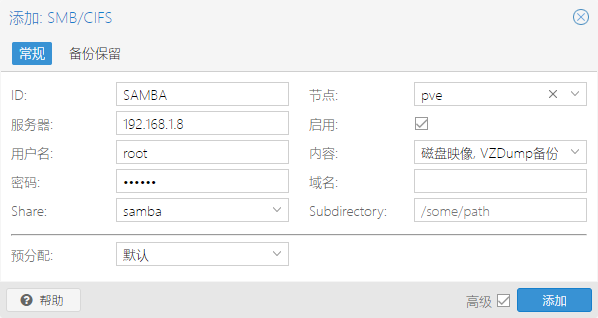

### PVE添加SMB/CIFS存储

---


## **适用场景**

将电脑或者其他非本机的存储究竟通过samba共享的方式添加给PVE，用来保存ISO镜像、存储备份等功能。


## 操作方法


**方式一：在PVE网页控制台添加**

打开网页控制台，在数据中心 -> 存储 -> 添加 -> SMB/CIFS，按要求填写即可。




但是，如果是最新的PVE8.0，因为samba版本的问题，可能出现如下问题：


那么，可以使用命令行的方式添加，见方式二。


**方式二：PVE命令行**

命令格式如下：

```shell
pvesm add cifs <storagename> --server <server> --share <share> [--username <username>] [--password ] [--smbversion <smbversion>]
```

<storagename> 存储在PVE的文件名称。

<server> samba服务端共享的 ip 地址，如局域网的一台电脑的 ip 192.168.1.8

<share> samba服务端共享的文件夹名称，如电脑上共享的文件夹 samba

<username> samba服务端登录的用户名。

<smbversion>samba版本，如上面方式一添加出现了错误，此处可设置版本为2.1


命令行如下：

```shell
pvesm add cifs SMB -server 192.168.1.8 -share samba -username roa -password -smbversion 2.1
```

然后输入登录密码，即可。

```shell
root@pve:~# pvesm add cifs SMB --server 192.168.1.8 --share samba --username root --password --smbversion 2.1
Enter Password: ******
root@pve:~#
```

 


